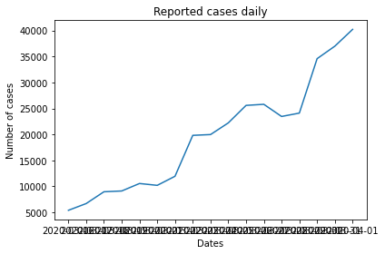
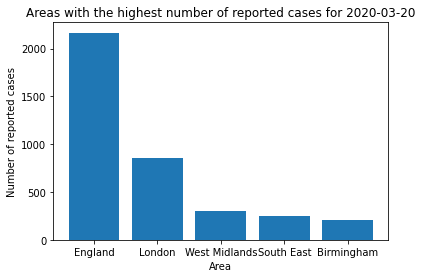
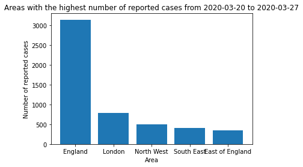
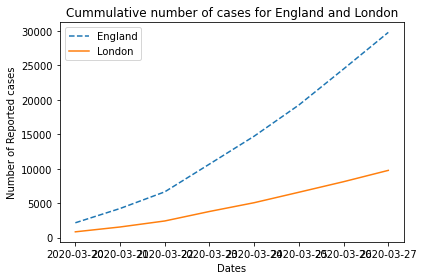
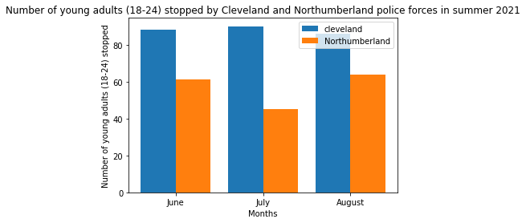
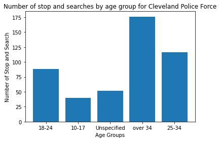
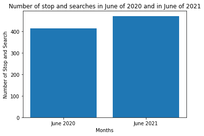
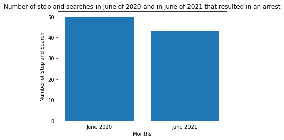
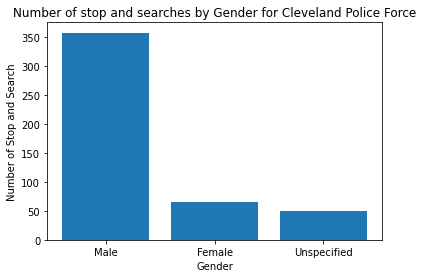

# DESCRIPTION OF FILES
-first_assignment.ipynb || Notebook cointaining all functions and plots for the first project which analyses daily number of COVID -19 cases data aggregated by age into 0-59, 60 plus and individual five-year bands in cities the United Kingdom

-second_assignment.ipynb || Notebook Using Python to retrieve data from the API of the UK police. https://data.police.uk/ is the site for open data about crime and policing in England,Wales, and Northern Ireland. A publicly available API provides detailed crime data andinformation about individual police forces and neighbourhood teams. Thedocumentation for this API can be found at https://data.police.uk/docs/CIS4044-N. It is possible to list out stop and searches by force, full details on this method can befound at https://data.police.uk/docs/method/stops-force/

-G_U_I.py || The Graphical User Interface(GUI) designed using tkinter to access all codes.

-Funcs.py || File containing all functions in the notebooks

-Test_func.py || File containing Unit testing for the functions in the code to confirm their functionality.

# COVID-19 CONFIRMED CASES VISUALIZATIONS

This markdown explains each of the plots and gives a visual depiction for each plot in the Project brief

For the first question, I visualized the number of total reported cases daily for a given date range

This chart plots each day on the x-axis and the number of reported cases on the y-axis

For the second question, I plotted the number of reported cases Weekly for a given date range

For the third question, I plotted the number of reported cases per month from the beginning of reporting
(NOTE:This chart might take a little while to load due to the amount of data it's loading)

For the fourth question, I plotted the areas with the highest number of reported case for a single date

For the fifth question, I plotted the areas with the highest positive cases for a seven day period

For the sixth question, I plotted the comparison of the number of cases reported for two areas for a given date period

For the seventh question, I plotted the comparison of the cummulative number of cases for two areas for a given date period

# STOP AND SEARCH  VISUALIZATIONS

This Project is about visualizing the information gotten from the Uk police data API
This API provides information on different incidents and actions

For this Project, I looked at stop and search by Police Forces in the UK

For the first question, I plotted the number of young adults between the ages of 18 and 24 stopped and searched by Cleveland and Northumberland Police forces

For the second question, I plotted the breakdown of the number of stop and searches conducted on each age group for a force in a month

For the third question, I plotted the number of stop and search conducted on June of 2020 during the pandemic and June of 2021

For the third question, I plotted the number of stop and search conducted on June of 2020 during the pandemic and June of 2021 that led to an arrest

For the fourth question, I plotted the number of stop and search for each gender type for a force

